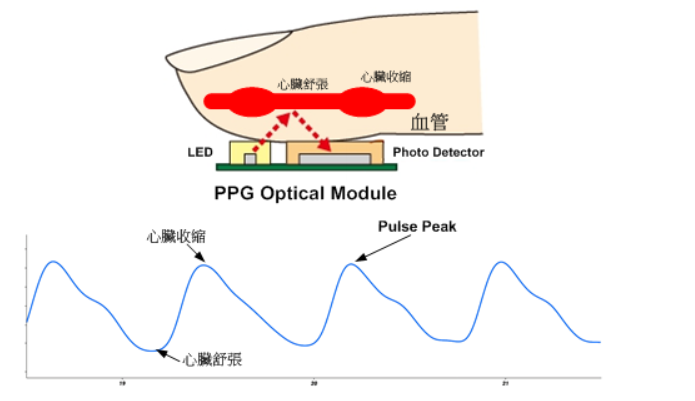
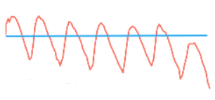
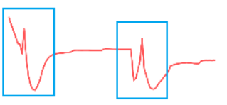
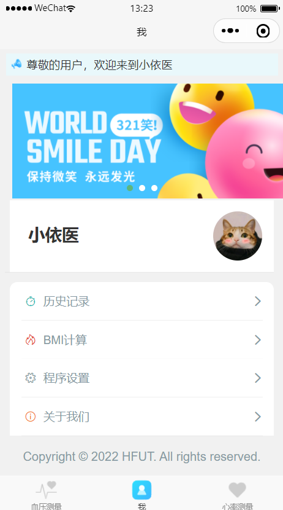
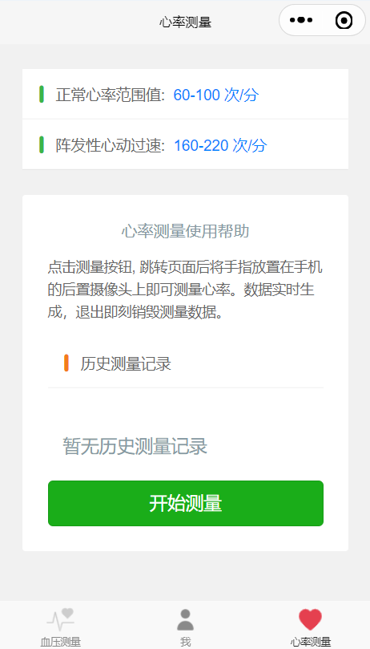
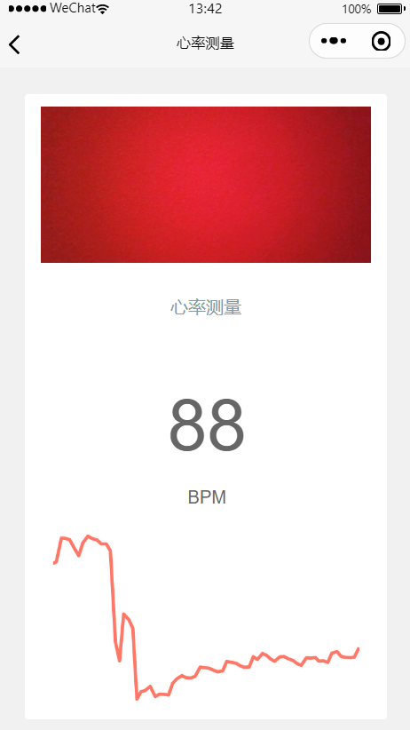

# 小依医

## 背景介绍

​    这个项目是我在大二的时候参加了一项校级大创项目, 我们小组的核心目标是基于**光电容积脉搏波描记法(Photoplethysmography，简称PPG)**, 来实现利用手机摄像头进行简易测量心率的效果。
    截止到目前为止, 项目顺利结题, 小组成员完成了基于Android完成了对应的软件开发, 以及一款简易功能的微信小程序。

​	本来打算再实现一下心率变异分析(Heart Rate Variability，缩写为HRV)的效果, 但由于当时除了要准备各种比赛, 还有一些痛苦的考试, 大家的日程难免过于紧凑。因此, 只完成了心率测量部分, HRV部分没有完成。

## 技术原理

​	心脏运作可以揭露人体许多极具价值的信息，包括其健康状态、生活方式，甚至是情绪状态及心脏疾病的早期发病等。传统的医疗设备中，监测心跳速率和心脏活动是经由测量电生理讯号与心电图 (ECG) 来完成的，需要将电极连接到身体来量测心脏组织中所引发电气活动的信号。

​	此外，随着心跳会有一压力波通过血管进行传递，这个波会稍微改变血管的直径，除了ECG外的另一选择──光体积变化描记图法 (Photoplethysmography, PPG) 就是利用这个变化，是一种无需测量生物电信号就能获得心脏功能信息的光学技术。

​	 当一定波长的光束照射到指端皮肤表面，每次心跳时，血管的收缩和扩张都会影响光的透射 (例如在透射PPG中，通过指尖的光线) 或是光的反射 (例如在反射PPG中，来自手腕表面附近的光线)。
     当光线透过皮肤组织然后再反射到光敏传感器时，光照会有一定的衰减。像肌肉、骨骼、静脉和其他连接组织对光的吸收是基本不变的 (前提是测量部位没有大幅度的运动)，但是动脉会不同，由于动脉里有血液的脉动，那么对光的吸收自然也会有所变化。

    图 1 : PPG技术模型

​	**PPG检测的核心是通过心脏跳动影响血管中血液光线的吸收率变化，进而影响血液对光的反射率，估算受测者的心率数据**。用人话说，心脏的跳动，会影响血液反射光的强度。
    反映到图表上，就如上图所示，心脏的舒张和收缩，会影响光强变化，形成上图的波动曲线。
    而心率的估算，则是通过计算60s内，有多少个波峰或者波谷。比如60s内，上图产生了60个个波峰，则意味着1s中，心脏收缩和扩张了一次，即跳动了一次，进而可以得出60BPM的心率数据。

## 技术实现

### 获取帧图像

​		小程序中，我们可以使用wx.createCameraContext()API来获取到视频流，同时借助onCameraFrame()来直接获取到每一帧的视频信息，极大的降低了开发的难度。通过前述的API，我们可以直接获取到当前帧Uint8数组，也就是每个像素的RGBA值。

### 检测传感器

​		为了避免外部光照影响血管对光线的反射，因此需要受测者的手指完全覆盖摄像头。为了检测摄像头是否覆盖，我们可以通过经验主义设定一个阈值，当每个像素的实际光强小于阈值，则代表传感器完全被覆盖，此时就可以开始测试。

### 获取光强数据

​		通过API，我们可以获得视频流中特定的一帧的Uint8数据。之所以使用Uint8是因为在该RGBA中，每一个通道的颜色只有256种，而我们仅仅是需要获取该帧中的光强。因此选用Uint8可以大幅度减少运算量，提高运行效率。

​		并且通过经验主义的测量以及结合论文的理论支持，我们可知血液在红光和绿光的照射下的吸收率是最大的，也就意味着强度值是最大的。因此可以更好的检测到强度变化，所以在后续的开发当中，我们都将使用单个像素中的红绿通道的强度值，来作为数据的来源。由于只使用了其中两个通道的强度值，我们的运算量就可以几何级数减少。

​		而获取光强的方法是: 
$$该帧光强值 =\frac{单个通道的强度值}{像素的个数}$$

### 计算波峰个数

​		计算波峰个数的一种简单的实现方法是通过经验值测算出一条固定的基线，来判断历史采集的光强值，有多少个跃出基线的数据，就计作多少个波峰。

   图 2 : 固定基线方式

​		但这种设计是有问题的，比如最右侧的波峰，因为各种外部原因强度没有达到基线，导致丢失。当通过人眼的辨识，这个波峰不属于噪声，应该是要被记录的。另外通过测试我们可以很容易的发现下图的假波峰和假波谷的噪声信号，这种变化幅度过大的数据也应该是被丢弃的。

   图 3 : 噪声曲线

​		因此需要对基线的计算方法做了改进。通过动态基线可以适应复杂环境光线的变化，提高测量的效率和准确性。通过动态基线，判断有多少多少次实际的跃出，进而换算出有多少个波峰。

### 计算BPM值

​		仅仅记录波峰个数是远远不够的，我们还要计算一次跃出所消耗的时间(从波谷到跃出基线到波峰所消耗的时间)。因为受测者的光线环境如果不稳定，含有频繁的光线变化，则可能导致光强变化幅度过大，造成数据的计算误差。
    因此我们还需要将跃出时间作为计算的一个因素，计算平均的跃出时间。最后计算出每分钟的心率次数：
$$BPM = \frac{测量最大实践}{平均跃出时间}$$

## 技术难点

​		小程序端最大的难点不在于测量算法的开发上。反而是在优雅的展示上画了大量的时间。

1. **FrameData质量:**

   通过Camera组件，我们可以直接获取到手机的视频流。由于我们这个算法中仅仅需要计算帧的光强，所以仅仅需要最低质量的FrameData即可。即降低了资源的消耗也提升了算法运行的效率。通过frame-data属性，修改为small即可启用最低质量的FrameData。

2. **Canvas绘图效率低:** 

   在去年小程序退出了Canvas 2D的绘图API，可以实现同层渲染。为了更高的渲染效率，我自然就是选择并使用了最新的API进行曲线的绘制。在电脑模拟器上的表现确实印证了效率更好的这一说法。但诡异的是在Android端上，Canvas2D的运行效率非常低，导致经常性假死，不知道怎么修复。因此只能暂时被搁置，待到日后有能力后再做修复。

## 结果展示

​		如下所示是最终实现的效果: 

|  |  |  |
| ------------------------------------------------------------ | ------------------------------------------------------------ | ------------------------------------------------------------ |

   图 4 : 最终效果

## 使用说明

​		你可以Fork当前的代码, 然后使用微信开发者工具打开本项目。微信开发者工具的安装可以参考黑马程序员的最新版微信小程序开发教程, 里面有详细的资料说明。

​		如果你喜欢本项目, 也请点击一下star支持一下。

## 个人收获

​		这次的开发通过学习更多前人的研究结论来帮助我将算法优化出来，收获满满。感觉到非常的振奋人心。期待后面能继续搞点好玩的DEMO。

## 参考文献

- [1] [ECG/PPG量测解决方案](https://www.richtek.com/Design Support/Technical Document/AN057?sc_lang=zh-CN)
- [2]  牛磊,艾海明,刘登辉等.光电容积脉搏波信号关键算法研究[J].中国医学装备,2023,20(04):1-5.
- [3]  石振乔. 基于PPG信号的血氧检测算法研究[D].海南大学,2022.DOI:10.27073/d.cnki.ghadu.2022.000372.

 

